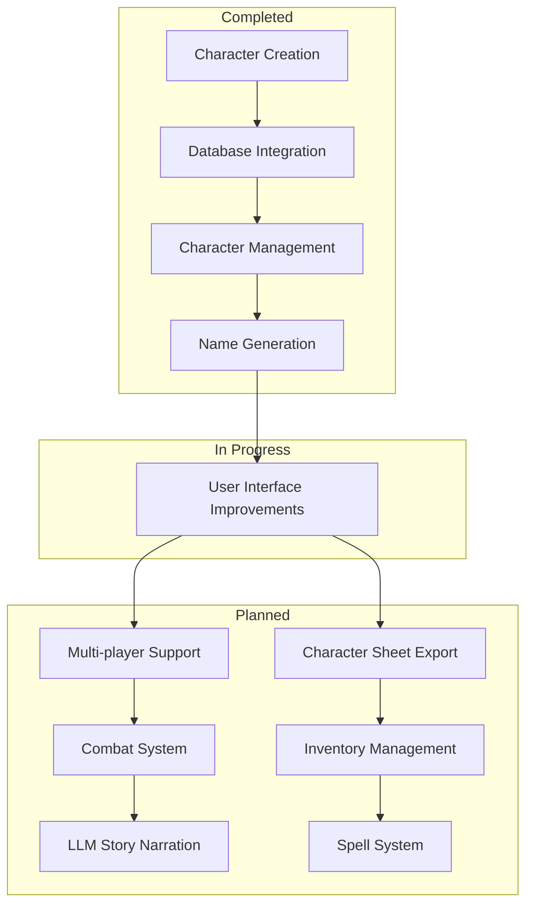

# **D&D World Generator**

A web-based Dungeons & Dragons character creation and management system. This application allows users to create, view, and manage D&D characters with features like random name generation based on race and gender.

## **Features**

- Character creation with:
  - Race selection (Human, Elf, Dwarf, etc.)
  - Class selection (Barbarian, Bard, Cleric, etc.)
  - Gender selection
  - Ability scores (Strength, Dexterity, Constitution, etc.)
  - Random name generation based on race and gender
- Character management:
  - View all created characters
  - Delete characters
  - Persistent storage using SQLite database

## **Project Roadmap**



## **Setup**

1. Install requirements:
```bash
pip install -r requirements.txt
```

2. Run the application:
```bash
python app.py
```

3. Access the application at `http://localhost:5000`


## **Checklist**

- [x] initial character creation added
- [x] database for character created
- [ ] Develop character stat interaction
- [ ] Implement enemies, creatures, etc.
- [ ] Implement weapons, spells, dice interactions, etc.
- [ ] Character inventory management
- [ ] LLM narration integration
- [ ] Map generration