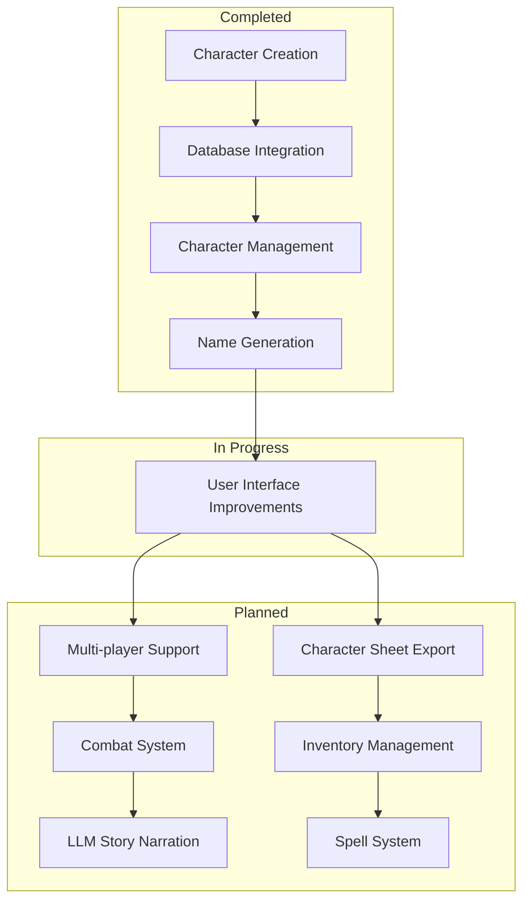

# **D&D World Generator**

A web-based Dungeons & Dragons character creation and management system. This application allows users to create, view, and manage D&D characters with features like random name generation based on race and gender.

## **Features**

- Character creation with:
  - Race selection (Human, Elf, Dwarf, etc.)
  - Class selection (Barbarian, Bard, Cleric, etc.)
  - Gender selection
  - Ability scores (Strength, Dexterity, Constitution, etc.)
  - Random name generation based on race and gender
- Character management:
  - View all created characters
  - Delete characters
  - Persistent storage using SQLite database

## **Project Roadmap**



## **Setup and Installation**

1. **Clone the repository**:
```bash
git clone https://github.com/NusretSalli/DND_World_Generator.git
cd DND_World_Generator
```

2. **Create and activate a virtual environment**:
```bash
# Windows
python -m venv .venv
.\.venv\Scripts\activate

# macOS/Linux
python -m venv .venv
source .venv/bin/activate
```

3. **Install requirements**:
```bash
pip install -r requirements.txt
```

4. **Initialize the database**:
```bash
python app.py
```

5. **Access the application**:
   - Navigate to `http://localhost:5000` in your web browser

## **Database Management**

### Working with Migrations

The project uses Flask-Migrate to handle database schema changes:

1. **Creating a new migration** (after changing models):
```bash
# Windows
$env:FLASK_APP = "app.py"
python -m flask db migrate -m "Description of changes"

# macOS/Linux
export FLASK_APP=app.py
python -m flask db migrate -m "Description of changes"
```

2. **Applying migrations**:
```bash
python -m flask db upgrade
```

3. **Resetting the database** (for major changes):
```bash
# Delete the database file
rm instance/dnd_characters.db

# Restart the application to create a fresh database
python app.py
```

## **Tips & Tricks**

1. **Character Creation**:
   - Ability scores follow D&D 5e rules with modifiers
   - HP is calculated based on class hit dice and Constitution
   - AC incorporates Dexterity modifier automatically

2. **Item Management**:
   - Items have weight that counts toward carrying capacity
   - Magical items can require attunement
   - Equipment can be assigned to specific slots

3. **Troubleshooting**:
   - If you see errors about missing columns, run migrations
   - For a clean start, delete the database file and restart